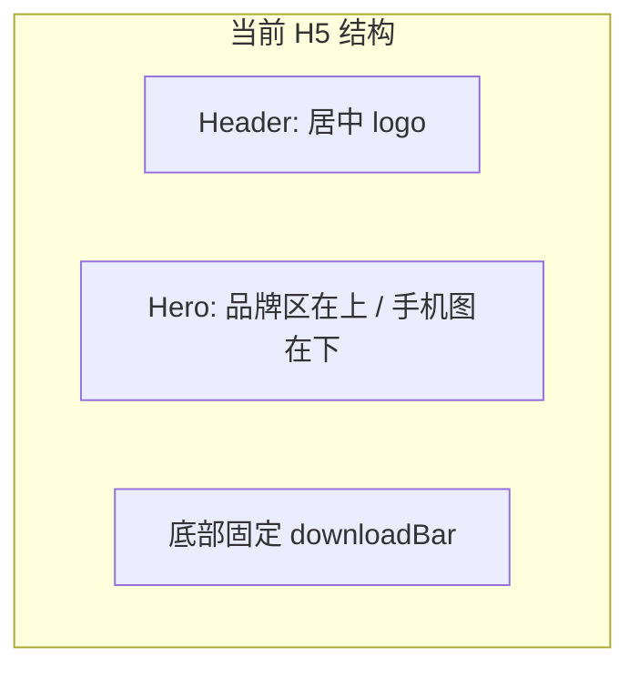
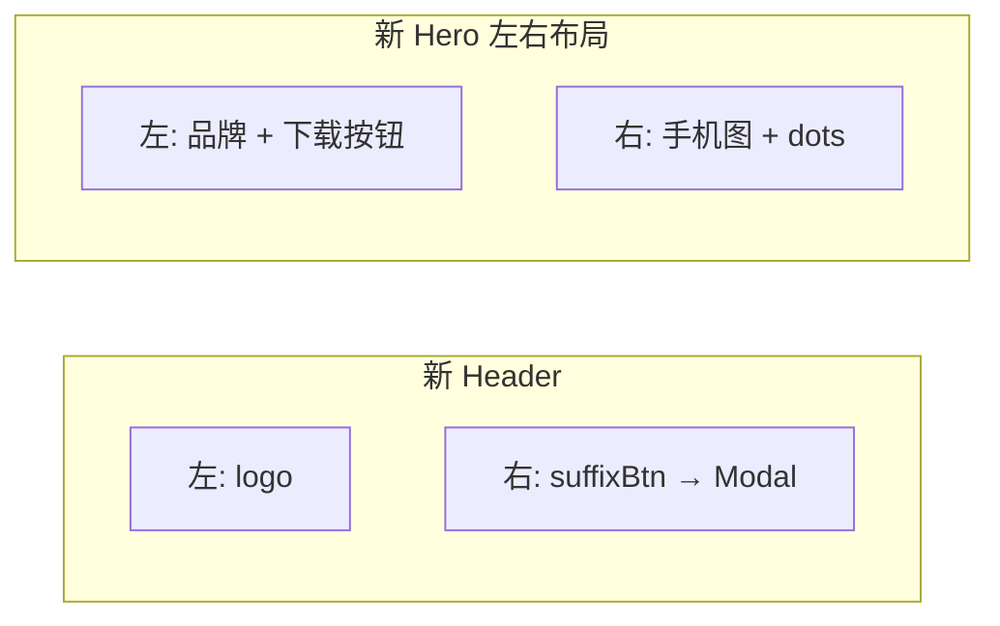

# H5 Header 与 Hero 布局改造

## 现状



- Header 仅居中 logo，无 CTA：[js/h5/render.js](js/h5/render.js) L3-9
- Hero 为块级垂直流：品牌 → 手机图：[styles.h5.css](styles.h5.css) L56-95
- 下载入口在 `renderDownloadBar`，固定底栏：[js/h5/init.js](js/h5/init.js) L40
- Modal 逻辑仅在 Web 端：[js/web/init.js](js/web/init.js) L86-117 + [js/web/render.js](js/web/render.js) L164-194

## 目标结构



---

## 1. 更新 [content.h5.json](content.h5.json)

**header** — 保留现有 `logo` / `logoAlt`，新增与 Web 一致的 CTA 与弹窗配置（可直接复用 [content.web.json](content.web.json) L15-24）：

```json
"header": {
  "logo": "./assets/nav-h5.png",
  "logoAlt": "FIRE记账",
  "suffixBtn": { "text": "去APP查看更多内容", "href": "#" },
  "modal": {
    "title": "移步至FIRE记账App",
    "subtitle": "查看/使用更多内容",
    "background": "./assets/modal-bg.png",
    "qrCodes": [
      { "label": "IOS版", "image": "./assets/wechat-1.png" },
      { "label": "安卓版", "image": "./assets/wechat-2.png" }
    ]
  }
}
```

**hero** — 从 `downloadBar` 迁入 `androidBtn` / `iosBtn`（字段与 Web hero 一致，href 沿用现有 H5 链接）：

```json
"androidBtn": { "text": "Android", "icon": "./assets/Frame@2x.png", "href": "..." },
"iosBtn": { "text": "iOS", "icon": "./assets/Frame_2@2x.png", "href": "..." }
```

**删除** 整个 `downloadBar` 区块。

---

## 2. 更新 [js/h5/render.js](js/h5/render.js)

### `renderHeader`

改为左右布局（参考 Web L24-33，去掉 nav）：

- 外层：`display: flex; justify-content: space-between; align-items: center`
- 左：`<a href="#hero">` + logo 图
- 右：`<button type="button" id="header-cta-btn" class="h5-header__cta">` + `data.suffixBtn.text`

### `renderHero`

参考 Web [renderHero](js/web/render.js) L36-68，结构调整为：

```
section.h5-hero
  div.h5-hero__content          ← 新增 flex-row 容器
    div.h5-hero__left             ← 左栏
      div.h5-hero__brand          ← icon + title + subtitle（保留现有）
      div.h5-hero__downloads      ← 新增，Web 风格 download-btn × 2
    div.h5-hero__phone-wrap       ← 右栏（保留 carousel dots）
```

- 下载按钮使用与 Web 相同的 markup：`class="download-btn"` + icon + text
- 按钮容器在 H5 用 `flex-direction: row`（左右并排，适配窄屏左栏）

### 移除 `renderDownloadBar`

删除 L146-161 整个函数。

### Modal 渲染

从 Web 复用，避免重复维护：

```js
export { renderAppModal } from '../web/render.js';
```

或在 [js/h5/init.js](js/h5/init.js) 中直接 `import { renderAppModal } from '../web/render.js'`。

---

## 3. 更新 [js/h5/init.js](js/h5/init.js)

- 移除 `renderDownloadBar` 的 import 与 `app.innerHTML` 中的调用
- 追加 `renderAppModal(data.header.modal)` 到 DOM 末尾（与 Web 一致）
- 新增 `initAppModal()`（从 [js/web/init.js](js/web/init.js) L86-117 复制，选择器 `#header-cta-btn` / `#app-modal` 不变）
- `init()` 末尾调用 `initAppModal()`

---

## 4. 更新 [styles.h5.css](styles.h5.css)

### Header（L29-53）

- `.h5-header`：`justify-content: space-between`（替换 `center`）
- 新增 `.h5-header__cta`：渐变背景按钮，尺寸适配移动端（参考 Web `.header-cta`，font-size 略小）

### Hero（L56-120）

- `.h5-hero__content`：`display: flex; flex-direction: row; align-items: flex-end; gap: 12px`
- `.h5-hero__left`：`flex: 1; min-width: 0`
- `.h5-hero__phone-wrap`：缩小宽度（如 `flex: 0 0 42%`），手机图 `max-width` 下调
- `.h5-hero__downloads`：`display: flex; flex-direction: row; gap: 8px; margin-top: 12px`
- 新增 `.download-btn` / `.download-btn-icon`（从 [styles.web.css](styles.web.css) L242-266 精简复制，按钮 padding/font 略小以适配 H5）

### Modal

从 [styles.web.css](styles.web.css) L62-200 复制 `.app-modal*` 与 `body.modal-open`，加 `html.platform-h5` 前缀 scope。

### 清理

- 删除 L417-477 全部 `.h5-download-bar*` 规则
- 删除 L24-26 `body.h5-body` 的 `padding-bottom: calc(72px + ...)`（原为底栏留空）

---

## 5. 可选：更新 [README.md](README.md)

H5 JSON 字段表中将 `downloadBar` 改为 `hero.androidBtn` / `hero.iosBtn`，并补充 `header.suffixBtn` / `header.modal` 说明（与 Web 对齐）。

---

## 关键文件变更一览

| 文件 | 变更 |
|------|------|
| [content.h5.json](content.h5.json) | header 增 suffixBtn/modal；hero 增下载按钮；删 downloadBar |
| [js/h5/render.js](js/h5/render.js) | header 左右布局 + CTA；hero 左右分栏 + 下载按钮；删 renderDownloadBar |
| [js/h5/init.js](js/h5/init.js) | 挂载 Modal + initAppModal；移除 downloadBar |
| [styles.h5.css](styles.h5.css) | header/hero/download-btn/modal 样式；删 download-bar 与 bottom padding |

## 验证方式

1. `npx serve .` 启动后，Chrome DevTools 切换移动设备（≤768px）
2. Header：左 logo、右「去APP查看更多内容」，无 nav
3. 点击 CTA → 弹出 QR Modal，Esc/遮罩/关闭按钮可关闭
4. Hero：左栏品牌+下载按钮、右栏手机图；无底部固定下载栏
5. Android/iOS 下载链接可正常跳转
